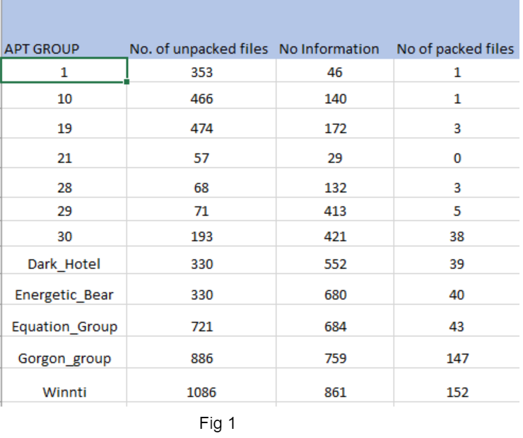
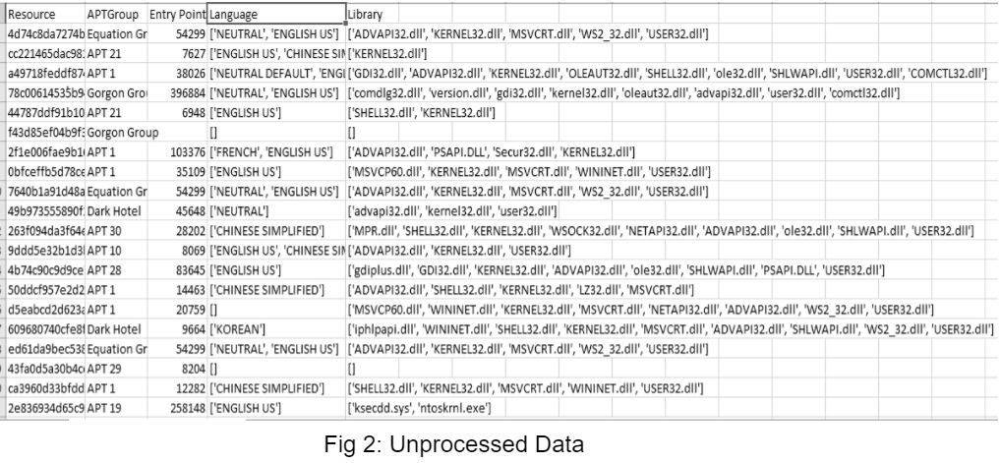
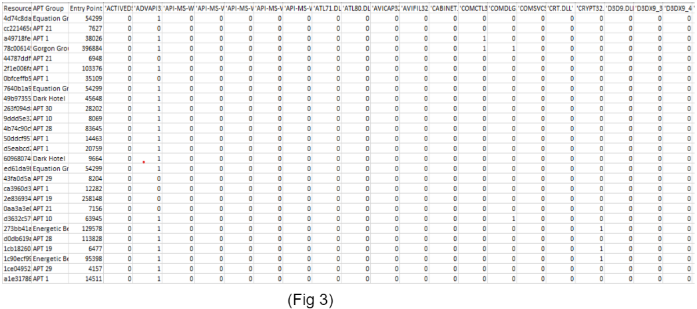
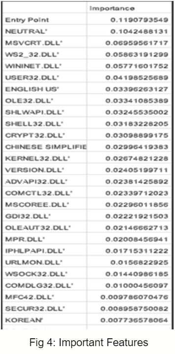

<!-- PROJECT LOGO -->
 

  

> Cyber Attack Attribution, Machine Learning, Random Forest Classifier, Malware Artifacts, APT

<!-- ABOUT THE PROJECT -->

## About The Research Project

### Project Description

Cyber attack attribution is the process of attempting to trace back a piece of code or malware to a perpetrator of a cyberattack. As cyber attacks have become more prevalent, cyber attack attribution becomes more valuable. The process of cyber attack attribution can be done using reverse engineering. From the metadata of the malware executable file, we can gather data such as date of creation, variable names used, and what library calls are imported. This information can be used as features for attribution analysis. We need to extract the features from malware that can be used for attribution and analyse them using some technique to attribute the attacks. 

### Motivation

Our interest stems from the increase in recent cyber attacks. It is important to analyse the malware and get its artifacts which can give us a hint of the attacker. Cyber attacks will only become more prominent as time goes on and as our society becomes more dependent on our technological infrastructure. Cyber attack attribution will be a key element in combating malware development by helping to classify the malware by type, authorship, and other key categories. This is especially useful when you consider state-sponsored malware. It is becoming imperative to be able to identify the authorship of the malware as well as the country the malware comes from because cyber warfare will eclipse traditional combat warfare in the future. Our team has experience with machine learning algorithms and is proficient with Python.

## Literature Review

### DeepAPT: Nation-State APT Attribution UsingEnd-to-End Deep Neural Networks
The authors here describe how the nation-state APT can be attributed by using its dynamic analysis as raw input to a deep neural network (DNN) allowing it to learn high level feature abstractions of the APTs itself. The nation-state APT problem is more complex since a nation may have many cyber units with different targets, functionality and framework. Therefore, the author attribution approach will not work. APT’s cannot be classified based only on frameworks and functionality. The authors used the Cuckoo Sandbox reports of samples of APT which were allegedly developed by nation-states as input to DNN. The DNN had a 10 layer fully connected network. The classifier achieved an accuracy of 94.6%. The authors concluded different nation-states use different APT developing methodologies, such that the works of developers in separate cyber units are still sufficiently similar to each other.

### MVFCC: A Multi-View Fuzzy Consensus Clustering Model for Malware Threat Attribution
The authors proposed a multi-view fuzzy consensus clustering model for attributing malware. The authors used the Cuckoo sandbox reports for the malware samples and converted the report for each malware to different views in four categories  namely Opcode, Bytecode, SystemCall and Header. The opcode and bytecode consists of the Binary, count, Frequency of occurrence, Term Frequency-Inverse Document Frequency and Eigen Vector modes. The authors then fuzzified each feature of all views using Trapezoidal and Triangular fuzzifier. They next used the Fuzzy Pattern tree (FPT) classification algorithm on views. FPT will result in a set of k (k= no of APT groups)classifiers being trained on each view. The authors now applied Fuzzy C-Means partitioning technique to divide malware in each APT group to several clusters. Classification and clustering provided a database of fuzzy metrics on which a decision tree was trained to provide the APT group for the malware sample. The decision tree aggregates information from different fuzzy learning algorithms. The authors were able to attribute malware samples to its APT actors correctly with 95% of accuracy. Therefore, a malicious actor needs to change all possible properties of the malware  to evade or fool the MVFCC

### Applying Supervised Learning on Malware Authorship Attribution
The authors of these papers proposed a method to attribute state-sponsored authorship of malware using the supervised learning approaches Ro18 and Am17. Ro18 is a supervised learning technique that analyzes malware reports generated by Cuckoo Sandbox and inputs it into a deep neural network in order to classify state-sponsored malware. Am17 is similar to Ro18, but focuses on family classification of criminal malware instead of just state-sponsored malware, and it uses a random forest classifier instead of a DNN. The results from Ro18 when given a scenario of unseen APT groups showed that the accuracy of the classifiers was highly dependent on the sandbox reports that were used. On the other hand, when working with samples of earlier seen APT groups, the DNN works much better overall, regardless of the sandbox environment used. When using Am17, the results with unseen APT groups are worse than the DNN solution, while working with seen APT groups yields similarly good results. https://github.com/cyber-research/APTMalware

### Deep learning based Sequential model for malware analysis using Windows exe API Calls
The authors experimented with classifying malware using a sequential model machine learning technique in a Cuckoo sandbox environment. The Long-Short Term model learning method was chosen because it allows long term dependency to be detected at random intervals. Using multiple malware datasets, they were able to test the LSTM model, but also develop data on API calls for Windows OS malware. To do so, they first started with filtering out rows that did not have 10 or more API calls. Next, they compared the hash values given by VirusTotal with the hash values of each of the malware samples to try and classify its type. Lastly, they used the joint data of the API call sequence and the malware classification to create and train a dataset. For this, decision trees, k-clustering, and support vector machines methods were used. The authors were able to test and classify malware behavior for 7107 Windows software samples. The success rate was between 83.5% and 98.5% with performance not being an issue. Although this experiment was more of a proof of concept, it did provide more insight of Windows API calls and malware correlation, as well as a dataset pertaining to this work.

### The Power of Threat Attribution- Kaspersky Threat Attribution Engine
Tracking, analyzing, interpreting and mitigating constantly evolving IT security threats is a massive undertaking. Threat intelligence (TI) has true value beyond the current hype around an emerging pocket in the information security industry. TI includes a number of different services that help organizations stay protected, increase awareness and assist with investigations. When it comes to threat intelligence, threat attribution is probably the most visible process and also a point of contention. And there is a definite reason for this. The average time from detection to response against highly sophisticated threats is usually too long due to complex investigation and reverse engineering processes. Today, in the digital era, organizations are obliged to instantly investigate, prioritize all alerts and accelerate the time to respond. Correct and timely attribution helps not only to shorten incident response times from hours to minutes but also to reduce the number of false positives. Attributing targeted attacks is a powerful and essential tool that: Evaluates if you are a target or an unintended victim, Provides insights into the actors behind the attack and their motivation, Enables effective detection, investigation, containment and response based on the  knowledge of the tactics, techniques and procedures specific to the threat actor. 
Some major threat attribution techniques are (1)Timestamps:One major benefit of the Portable Execution (PE) format is that compilation times are always included. Though they can be easily altered, many samples have the original timestamps. There are a few important indicators that timestamps can show. (2)Strings, debug paths and metadata: Implanted binary code can also expose interesting details about the authors. The artifacts include their preferred language as well as debug paths, which often reveal a username, as well as internal naming conventions for internal tools, projects or campaigns. Also metadata that might reveal the configuration of the developer’s system. (3)Infrastructure and backend: infrastructure reuse is the most telling sign that an attacker is resurfacing or retooling. When attackers retrieve data from the email account of an exfiltration server, prepare staging or phishing servers or check on the availability of a compromised domain, they almost always use an anonymizing service. (4)Exploits: Zero-day exploits are a great source of details about the actor behind an attack. The presence of a “0-day” immediately sets an actor apart from ordinary attackers. (5)Targeted victim: Though many indicators may be faked or altered, the dynamic between attacker and victim is harder to hide or directly manipulate as it involves ‘real-world’ publicly known circumstances or geopolitical conflicts. This insight allows for attacker profiling. A possible outcome is the mapping of a campaign to a geopolitical or regional situation that may point in the direction of a given perpetrating organization or nation. 

### When Coding Style Survives Compilation: De-anonymizing Programmers from Executable Binaries
There is a way to identify authors of a computer program based on their coding style: variable names, spacing, etc… It has been shown that source code can be attributed to authors with high accuracy, although attribution of executable binaries seem to be a lot more difficult. They used machine learning to find patterns and they decompiled the executable binary to source code. They evaluated their approach from data from Google Code Jam and had an attribution accuracy of up to 96%. This is preserved in the compilation process and this can be extracted from the executable binary. It may be possible to infer the  programers identity if we have a set of KNOWN potential candidate programmers, along with executable finary samples known to be authored by these candidates. This has a forensics application as they can consistently identify virtual personas and individual malicious cyber operators over time. We see hackers try to obscure their binaries so it cannot be traced back to them although we find that traditional binary obfuscation, enabling compiler optimizations, or stripping debugging symbols in executable binaries results in only a modest decrease in de-anonymization accuracy.We emphasize that research challenges remain before programmer de-anonymization from executable binaries is fully ready for practical use. For example, programs may be authored by multiple programmers and may have gone through encryption. They approach this problem using supervised machine learning, that is, we generate a classifier from training data of sample executable binaries with known authors. A drawback is that the method is inoperable if samples are not available or too short to represent authorial style.

## Technical Approach
First, our team identified a GitHub repository of pre-classified state sponsored malware that we will be using as our dataset. We then performed static analysis on the malware samples. We didn’t go for dynamic analysis since the setup of Cuckoo would take a lot of time and the accuracy of static analysis was very good. We didn’t use any specific environment for malware analysis, since we didn’t perform dynamic analysis and there was no need to execute the malware samples. We have generated the VirusTotal reports for the malware samples. We have fetched various attributes from the VirusTotal reports and use those attributes as inputs to our Random Forest Algorithm.

### Data Gathering
As we mentioned in the initial project proposal, during our research we found a repository in Github ( https://github.com/cyber-research/APTMalware)  that contained about 4,500 country-sponsored malware samples [3] that we decided to use as our dataset. We also have access to the VirusTotal Developers API and have created a script that will send the hash value of all malware samples to the VirusTotal API and download the reports for all malwares as a json file.

### Data Classification, Extraction, and Use
Since we plan on doing static analysis, we needed to consider whether the malwares were packed or not. Packing is a form of code obfuscation that modifies the format of the malware by compressing or encrypting the data, so we would not be able to extract the artifacts we need without putting the malware through some type of unpacking software. Because of this, we used a tool called PEiD that can detect whether or not a malware sample is packed and classified all of our malware into either unpacked or packed categories. The number of packed and unpacked malwares per APT group are summarized in the table below (Fig 1). We have only used unpacked malware samples for attribution to APT Group. The number of unpacked malware samples are 3591.

We have extracted the following attributes from the VirusTotal reports for each malware sample
* pe-resource-langs
* imports
* pe-entry-points

We created a python script that would extract the above attributes from each of the json malware report  files and consolidate it into one csv file.We created a CSV  file with the above three attributes , resource (i.e hash of the malware) and APT group columns which we fetched from the GitHub repository. Please see a snapshot of unprocessed dataset below.(Fig 2).

## Data Preprocessing
Next, the data needed to be cleaned in order for it to be used as input to  the machine learning model. Brackets and commas in the language and library column were removed and all values were formatted to be uppercase so the model will not differentiate between them and give inaccurate results. Then, the column for the library and language features were one hot encoded. This resulted in creation of dummy variables for each unique library and language value.  Lastly, the APT groups were mapped to integers so they can properly be used in the classifier model. Also we removed 792 rows with null values in multiple columns. After preprocessing, we were left with 148 features and 2862 rows. Check the snapshot of preprocessed data given below (Fig 3)

## Machine Learning Model
For our machine learning analysis, we decided to use Random Forest since it uses multiple decision trees which prevent overfitting. Also, it is very easy to calculate the important features in Random Forest. As well as, the Random Forest protects error correlation between prediction trees. We chose a 70-30 split for the data for training and testing. We used scikit-learn RandomForestClassifier function. The initial value for hyperparameters of the RandomForestClassifier were:

* min_samples_leaf=50,
* n_estimators=150,
* bootstrap=True,
* oob_score=True,
* n_jobs=-1,
* random_state=seed,
* max_features='auto'
The model achieved 58% accuracy. We did some hyperparameter tuning. We adjusted the number of estimators to 300 and the minimum number of leaf samples to 3. The accuracy was 83%. We also perform random cross-validation to ensure our model is not overfitting or underfitting. For 20 fold random cross-validation, we achieve an accuracy of 86% which proved the model was not underfitting or overfitting. We also calculated the features that contributed most to the classification.(Fig 4). The attribute entry point is the most important attribute followed by neutral which is the value for the pe-resource-langs.

## Conclusion
The model was quite efficient with only three main features and 2862 malware samples. The accuracy of the model may increase by using more features such as entropy, no of sections or more malware samples. We extracted less features due to time constraint and there is a lack of APT malware datasets. Also, the data preprocessing was very rigorous and took a lot of time. In the future, one can extract more attributes from the VirusTotal report and incorporate it into the dataset. One can also go for dynamic analysis using Cuckoo sandbox and use neural networks for classification. 

## Bibliography
[1] Boot, Coen. Applying Supervised Learning on Malware Authorship Attribution. Diss.    Radboud University Nijmegen, 2019.

[2] Aylin Caliskan, Fabian Yamaguchi, Edwin Dauber, Richard Harang, Konrad Rieck, Rachel Greenstadt, Arvind Narayanan “When Coding Style Survives Compilation: De-Anonymizing Programmers from Executable Binaries.” N.p., 2015. Web.
https://arxiv.org/abs/1512.08546

[3]  Ferhat Ozgur Catak​, Ahmet Faruk Yazı,Ogerta Elezaj, Javed Ahmed “Deep Learning Based Sequential Model for Malware Analysis Using Windows Exe API Calls.” PeerJ. Computer science 6 (2020): e285–. Web.
https://peerj.com/articles/cs-285/

[4] Haddadpajouh, Hamed ; Azmoodeh, Amin ; Dehghantanha, Ali ; Parizi, Reza M. “MVFCC: A Multi-View Fuzzy Consensus Clustering Model for Malware Threat Attribution.” IEEE access 8 (2020): 139188–139198. Web.

[5] Kaspersky, Eugene, et al. “The Power of Threat Attribution-Kaspersky Threat Attribution Engine” https://media.kaspersky.com/en/business-security/enterprise/threat-attribution-engine-whitepaper.pdf

[6] Rosenberg, Ishai ; Sicard, Guillaume ; David, Eli “DeepAPT: Nation-State APT Attribution Using End-to-End Deep Neural Networks.” Artificial Neural Networks and Machine Learning – ICANN 2017 Lecture Notes in Computer Science, 2017, pp. 91–99., doi:10.1007/978-3-319-68612-7_11. 

<!-- CONTACT -->

## Contact

Pritom Das Radheshyam - [Portfolio Website](https://pritom.uwu.ai/)
[![LinkedIn][linkedin-shield]][linkedin-url]  
[Dhruv Mehta] [![LinkedIn][linkedin-shield]][linkedin-url-dm]

<!-- MARKDOWN LINKS & IMAGES -->
<!-- https://www.markdownguide.org/basic-syntax/#reference-style-links -->

[linkedin-shield]: https://img.shields.io/badge/-LinkedIn-black.svg?style=flat-square&logo=linkedin&colorB=555
[linkedin-url]: https://www.linkedin.com/in/you-found-pritom
[linkedin-url-dm]: https://www.linkedin.com/in/dhruv-mehta212/
[product-screenshot]: images/screenshot.jpg
[Dhruv Mehta]: https://github.com/mehtadhruv1
